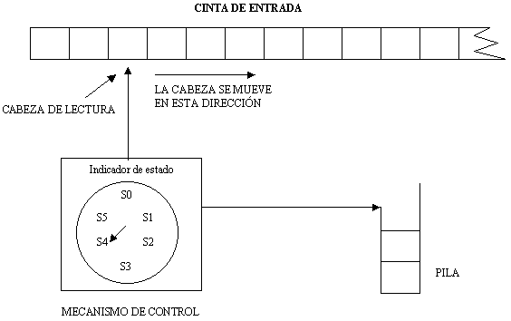

# Práctica 2: Programar un simulador de un autómata con pila

<p align="center">
  
</p>

## Descripción.

Un autómata con pila, autómata a pila o autómata de pila es un `modelo matemático` de un sistema que recibe una cadena constituida por símbolos de un alfabeto y determina si esa cadena pertenece al lenguaje que el autómata reconoce. El lenguaje que reconoce un autómata con pila pertenece al grupo de los `lenguajes libres de contexto` en la clasificación de la Jerarquía de Chomsky.

## Objetivo del proyecto.

El objetivo de la práctica consiste en programar un **simulador de un autómata con pila**, realizando un diseño **orientado a objetos**.

## Tipo de finalización del autómata.

En este caso, se ha optado por simular un autómata con pila con `finalización por estado final`.

## Esquema del proyecto.

```
├── .gitignore
├── Makefile
├── README.md
├── automatapila
├── APf/
|   |── APf-1.txt
|   |── APf-2.txt
│   └── APf-3.txt
├── APv/
|   |── APv-1.txt
|   |── APv-2.txt
|   └── APv-3.txt
├── images/
│   └── AutomataPila.gif
├── src/
│   ├── main.cc
│   ├── automatapila/
│   │   ├── automatapila.cc
│   │   └── automatapila.h
│   ├── alfabeto/
│   │   └── alfabeto.h
│   ├── cadena/
│   │   └── cadena.h
│   ├── estado/
│   │   ├── estado.cc
│   │   └── estado.h
│   ├── pila/
│   │   ├── pila.cc
│   │   └── pila.h
│   ├── simbolo/
│   │   └── simbolo.h
│   ├── transicion/
│   │   ├── transicion.cc
│   │   └── transicion.h
│   ├── funciones_auxiliares.cc
│   └── funciones_auxiliares.h
```

## Fichero de entrada.

Los **elementos del autómata con pila** se introducirán en tiempo de ejecución del programa utilizando un **fichero de texto** con el siguiente formato:
- \# Comentarios
- q1 q2 q3 … # conjunto Q
- a1 a2 a3 … # conjunto Σ
- A1 A2 A3 … # conjunto Γ
- q1 # estado inicial
- A1 # símbolo inicial de la pila
- q2 q3 # conjunto F (solamente en el caso de APf)
- q1 a A1 q2 A # función de transición: (q2, A) ∈ δ (q1, a, A1)
- ... # cada una de las transiciones en una línea distinta

`NOTA:` En caso de error en la creación del autómata, se indicará por consola y se finalizará la ejecución del programa.

## Requisitos

1. **Compilador de C++**.
2. **Make** (compilación automática).

## Ejecución del programa

1. Abrir terminal y ejecutar el siguiente comando en la **raíz del proyecto**.

```bash
make
```

2. Una vez compilado, tendremos un ejecutable llamado `automatapila`, al que le tendremos que pasar como parámetro el nombre del fichero con los elementos del autómata.

```bash
./automatapila <nombre_fichero>
```

3. En tiempo de ejecución, nos preguntarán si queremos realizar la ejecución con el `modo traza` activo o no (s/n). Posteriormente, podremos introducir las cadenas a evaluar por consola. Finalmente, el programa nos indicará si la cadena ha sido aceptada o no con un mensaje.


`NOTA:` Podemos obtener más información del funcionamiento del programa ejecutando el siguiente comando en la raíz del proyecto:

```bash
./automatapila --help
```
