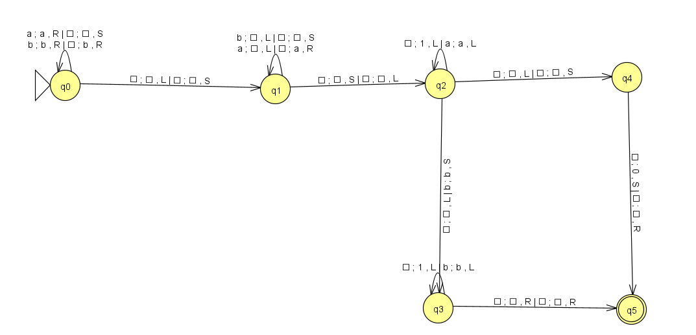

# Práctica 03. Programar un simulador de una Máquina de Turing determinista

<p align="center">
  
</p>

## Descripción

Una máquina de Turing es un dispositivo que manipula símbolos sobre una tira de cinta de acuerdo con una tabla de reglas. A pesar de su simplicidad, una máquina de Turing puede ser adaptada para simular la lógica de cualquier algoritmo de computador y es particularmente útil en la explicación de las funciones de una CPU dentro de un computador.

## Objetivo del proyecto

El objetivo de la práctica consiste en programar un simulador de una Máquina de Turing, realizando un diseño orientado a objetos.

## Notas de implementación

- `Escritura y movimientos independientes`.
- Movimientos: `"L", "R" y "S"`.
- Cinta infinita en `ambas direcciones`.
- `Multicinta`.

## Fichero de entrada

- \# Comentarios
- q1 q2 q3 … # conjunto Q
- a1 a2 a3 … # conjunto Σ
- A1 A2 A3 … # conjunto Γ
- q1 # estado inicial
- b # símbolo blanco
- q2 q3 # conjunto F
- 1 # número de cintas
- q1 a1 q2 a2 m # función de transición : δ (q1, a1) = (q2, a2, m)
- ... # cada una de las transiciones en una línea distinta

`NOTA:` En caso de error en la creación del autómata, se indicará por consola y se finalizará la ejecución del programa.

## Requisitos

1. **Compilador de C++**.
2. **Make** (compilación automática).

## Ejecución del programa

1. Abrir terminal y ejecutar el siguiente comando en la **raíz del proyecto**.

```bash
make
```

2. Una vez compilado, tendremos un ejecutable llamado `maquinaturing`, al que le tendremos que pasar como parámetro el nombre del fichero con los elementos de la máquina.

```bash
./maquinaturing <nombre_fichero>
```

3. En tiempo de ejecución, podremos introducir las cadenas a evaluar por consola. Finalmente, el programa nos indicará si la máquina ha parado en un estado de aceptación y mostrará la cinta.


`NOTA:` Podemos obtener más información del funcionamiento del programa ejecutando el siguiente comando en la raíz del proyecto:

```bash
./maquinaturing --help
```

## Ejercicios realizados

1. MT que reconozca el lenguaje L = { a^n b^m | m > n, n ≥ 0 }

<p align="center">
  
</p>

2. MT que reciba como parámetro una cadena compuesta por símbolos ‘a’ y ‘b’. La MT debe sustituir la cadena por el número de símbolos ‘b’, seguido del número de símbolos ‘a’ separados por un símbolo blanco. El número se codificará como n = 1^n. La cabeza de L/E se quedará al principio del resultado:

- Ejemplo: 
    - Cinta inicial (con la cadena de entrada): •abbabaabb•
    - Cinta final (con el resultado): •11111•1111•
    - Si no hay símbolos ‘b’ se escribirá un 0 en sustitución del número.
    - Si no hay símbolo ‘a’ no se incluirá ningún dato.
- Ejemplos: 
    - Cinta al inicio (con la cadena de entrada): •aa•
    - Cinta al final (con el resultado): •0•11•
    - Cinta al inicio (con la cadena de entrada): •bb•
    - Cinta al final (con el resultado): •11•

<p align="center">
  
</p>